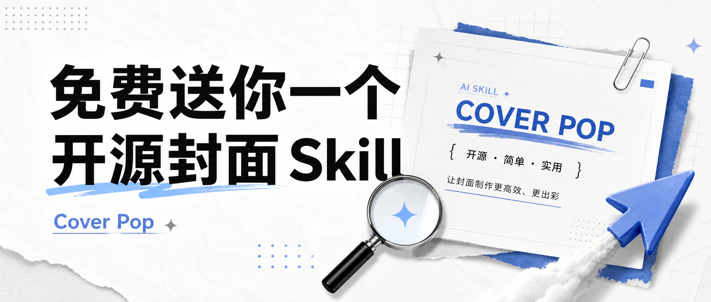

# Cover Pop / 封面爆款

> 为公众号、视频号、小红书、课程和开源项目生成高点击率中文封面与标题视觉。

Cover Pop 处理的是第一眼：标题怎么写、主视觉怎么摆、字多大、封面在缩略图里还能不能赢。它适合公众号题图、外部预览图、短视频封面、开源项目宣传图、课程海报。

## 示例图

<p><br><sub>开源封面 Skill 示例</sub></p>
<p><br><sub>Paper Operators 公众号封面</sub></p>

## 它能做什么

- 把主题改写成更有传播力的中文封面标题和副标题。
- 选择封面 archetype：免费送、反常识、清单、结果承诺、实测报告、避坑提醒等。
- 规划 900x383 公众号封面、方图预览、竖版海报等构图。
- 检查标题可读性、缩略图存活率、裁切安全区和视觉冲突。

## 安装

把这个仓库克隆到本机 Codex skills 目录：

```bash
mkdir -p ~/.codex/skills
git clone https://github.com/Alexsun1one/cover-pop.git ~/.codex/skills/cover-pop
```

如果你的 Agent 使用其它 skills 目录，也可以把包含 `SKILL.md` 的这个仓库复制过去。

## 怎么用

示例请求：

```text
用 cover-pop 做一张 900x383 公众号封面。主题：免费送你一个开源 AI Skill。标题要大，中文要直接生成在图里，缩略图也能读。
```

Skill 入口是 [`SKILL.md`](SKILL.md)。细则在 [`references/`](references/)；如果这个仓库带脚本，脚本在 [`scripts/`](scripts/)。

## 质量要求

- 先服务内容，再服务风格；图必须解释一个具体想法。
- 中文默认要可读，标题、caption、标签不能只当装饰纹理。
- 同一组图要风格统一，但每张图要贴合自己的段落/用途。
- 示例图是工作流参考，不是唯一模板。

## 公众号

更完整的拆解、提示词、案例复盘、AI 写作和产品实践，我会继续写在公众号里。下面是我的真实公众号二维码/搜一搜卡片，不是仿造的装饰二维码。

<p align="center">
  
</p>

## 开源协议

MIT。见 [`LICENSE`](LICENSE)。

## 声明

这是 Sun Wuyuan / Alexsun1one 的原创开源 Skill 包。它不隶属于 OpenAI、GitHub、微信或任何被提及的平台。请不要用它去复制受保护 IP、仿冒在世艺术家，或暗示不存在的品牌背书。
